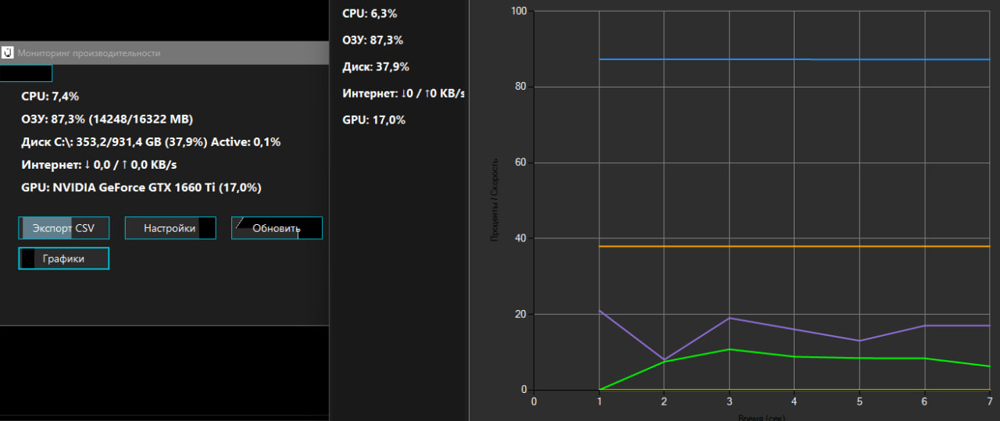

# Performance Dashboard
---
- Приложение на **WinForms**, которое показывает загрузку системы (CPU, RAM, Disk, Network, GPU) с графиками и выбором тем
---
- An application on **WinForms** that shows the system load (CPU, RAM, Disk, Network, GPU) with graphs and a selection of themes
---

---

## О приложении
- Мониторинг загрузки процессора, памяти, диска, сети и GPU
- Графики в реальном времени
- Настраиваемые темы оформления (JSON)
- Экспорт данных в CSV
---
## About the app
- Monitoring CPU, memory, disk, network, and GPU usage
- Real-time graphics
- Customizable design themes (JSON)
- Export data to CSV
---
## NuGet Packages
- System.Windows.Forms.DataVisualization
- OpenHardwareMonitor
---
## Запуск приложения
- Склонируйте репозиторий
- Откройте решение в Visual Studio 2022 или новее
- Восстановите NuGet пакеты
- Запустите проект
---
## Launching the app
- Clone the repository
- Open the solution in Visual Studio 2022 or later
- Restore NuGet packages
- Launch the project
---
- Если у вас нет иконок и т.д, то просто заходите в папку Resources/icons(themes), выбирайте их все в своей IDE, зайдите в свойства и поставьте "Копировать всегда"
---
- If you don't have icons, etc., then just go to the Resources/icons(themes) folder, select them all in your IDE, go to properties and set "Copy always"
---
## Архитектура
- Program.cs - вход
---
- Forms/ - тут все формы:
- Form1.cs - главная форма
- ChartsForm.cs - графики
- SettingsForm.cs - выбрать тему для форм
---
- Models/ - модели данных
- CpuInfo.cs - информация о ЦП
- DiskInfo.cs - информация о диске
- GpuInfo.cs - информация о ГП
- NetworkInfo.cs - информация о интернет сети
- MemoryInfo.cs - информация о памяти
- Theme.cs - модель темы
---
- Services/ - сервисы для получения информации о системе
- SystemMonitorService.cs - сбор данных о системе
- ThemeService.cs - загрузка и сохранение тем
- ThemeManager.cs - применение тем на форму
- IconService.cs  - загрузка иконок
- LoggingService.cs - логирование ошибок
- ExportService.cs - экспорт в CSV
---
- Resources/ - ресурсы приложения
- icons/ - иконки в png
- themes/ - темы в формате JSON
---
## Architecture
- Program.cs - login
---
- Forms/ - all forms are here:
- Form1.cs - the main form
- ChartsForm.cs charts
- SettingsForm.cs - choose a theme for forms
---
- Models/ - data models
- CpuInfo.cs - CPU information
- DiskInfo.cs - information about the disk
- GpuInfo.cs - GP information
- NetworkInfo.cs - information about the Internet network
- MemoryInfo.cs - information about memory
- Theme.cs - theme model
---
- Services/ - services for obtaining information about the system
- SystemMonitorService.cs - collecting system data
- ThemeService.cs - loading and saving themes
- ThemeManager.cs - applying themes to a form
- IconService.cs - loading icons
- LoggingService.cs - error logging
- ExportService.cs - export to CSV
---
- Resources/ - application resources
- icons/ - png icons
- themes/ - themes in JSON format
---