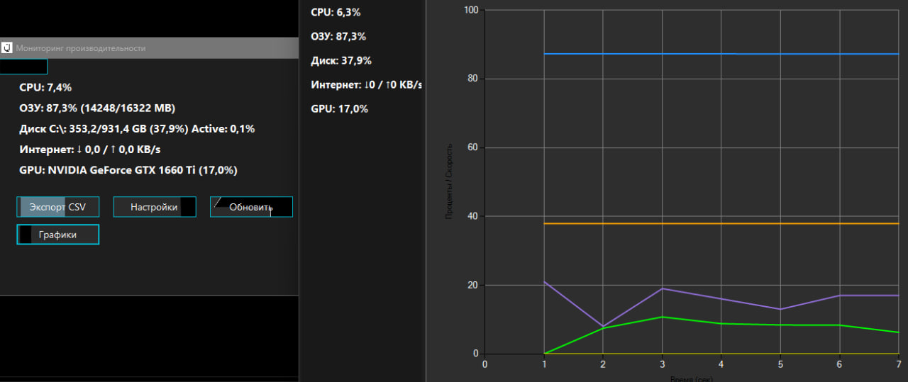

# Performance Dashboard
---
- Приложение на **WinForms**, которое показывает загрузку системы (CPU, RAM, Disk, Network, GPU) с графиками и выбором тем
---
- An application on **WinForms** that shows the system load (CPU, RAM, Disk, Network, GPU) with graphs and a selection of themes
---

---
- Подробнее в папке PerformanceDashboard
---
- For more information, see the PerformanceDashboard folder
---
